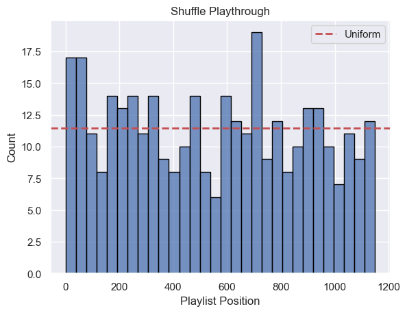
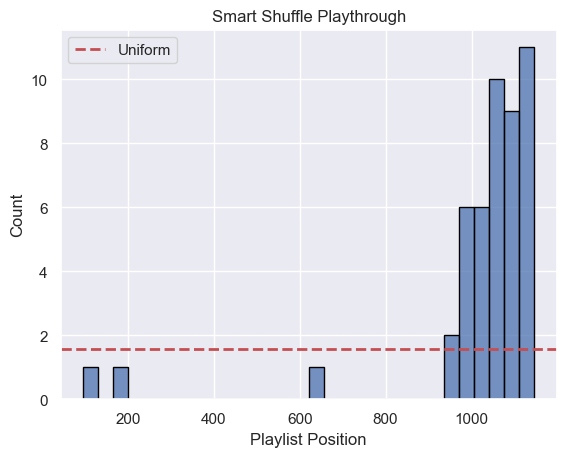
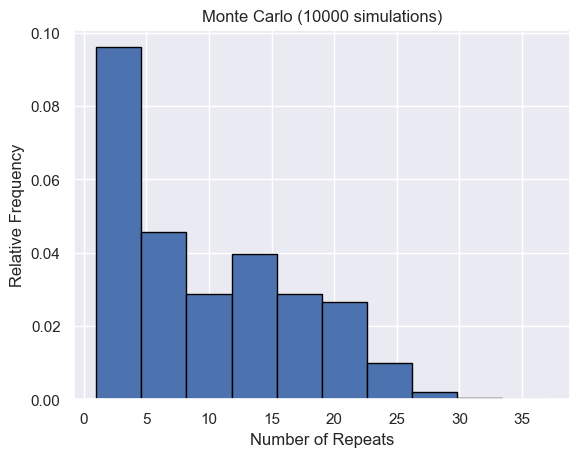
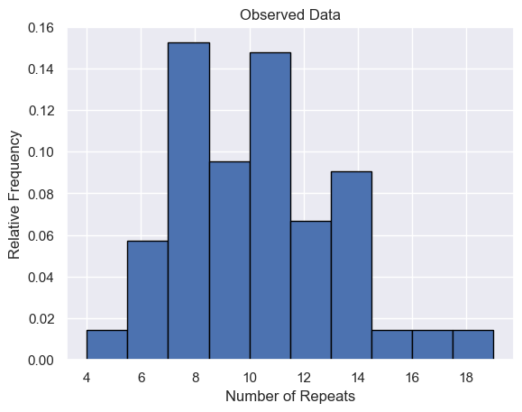

# Spotify Shuffle Analysis

## Overview
In this project, I analyze Spotify's shuffle modes to identify any underlying patterns and determine whether they are truly random.

## Project Structure
- 📂 **data:** collected Spotify data
- 📂 **figures:** data visualizations
- 📂 **src**
    - 📄 **`generate_data.py`:** script for automatically generating Spotify data
    - 📄 **`analysis.py`:** notebook for performing analysis and hypothesis testing
- 📄 **.env:** API key storage
- 📄 **requirements.txt:** project dependencies

## Methodology
There are two main phases to this project.
1. **:musical_note: Data Collection:** Utilizing Spotify's API to collect personal playback data.
2. **🎲 Assessing Randomness:** Investigating distributions and performing statistical analyses.

## Results
### Normal Shuffle vs. Smart Shuffle
I first looked at the distribution of the songs played in both normal shuffle as well as "smart" shuffle. I plot the distributions of each based on how recently the song was added to the playlist.

  
  

The normal shuffle appears to be uniformly distributed with respect to the date the song was added, while the smart shuffle clearly biases towards more recently added songs. Both claims are supported by Chi Square goodness of fit tests.

### Monte Carlo Simulations
Next, I perform truly random Monte Carlo simulations to find the distribution of repeated songs across multiple shuffled playthroughs. I compare this to my collected data as a test of randomness.

  
  

The observed data doesn't seem to follow the distribution if the shuffling were truly random. This is also supported by a goodness of fit test.  

More details can be found in [the following notebook](https://github.com/scs5/spotify-shuffle-analysis/blob/main/src/analysis.ipynb).
